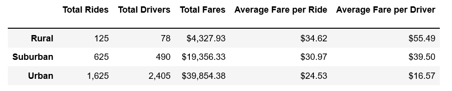
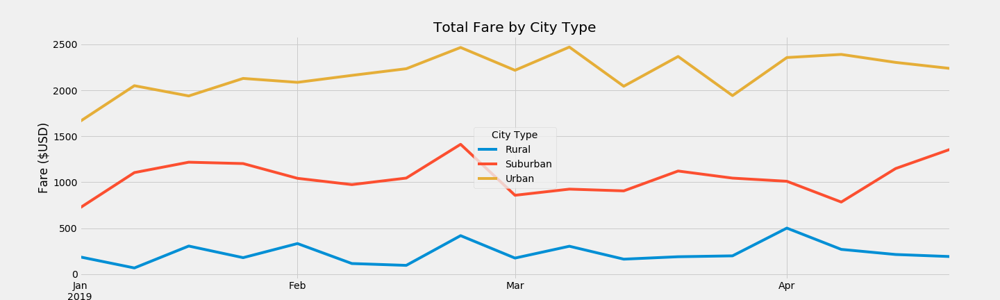

## Module 5 PyBer_Challenge - PyBer Final Report

The purpose of Module 5: PyBer with Matplotlib was to learn how to graph data using the Matplotlib library to create charts that visualize data in a Data Series or DataFrame. The three key deliverables of the Challenge were:
   - A DataFrame that summarizes the key metrics for the ride-sharing data by city type
   - Multiple-Line Plot for the Sum of the Fares for Each City Type
   - A written analysis created for the CEO, in the form of a README.md 
The data was analyzed in pandas DataFrames and with Matplotlib graphics to better understand the story of the data. Numerous charts including line charts, bar charts, scatter plots, bubble charts, pie charts, and box-and-whisker plots were created during this assignment to visualize the data. SciPy, a statistical Python package, and NumPy, a fundamental package for scientific computing in Python were also used to analyze the data and perform summary statistics.

The Summary DataFrame (above) indicates that there are are over 10 times more rides in Urban cities than in Rural cites. This equates to just under 10 times the Total Fares for these same city types. The Average Fare per Ride in Rural areas is higher than Suburban cites which is higher than Urban cities. This disparity in average fare is likely due to shorter trips in urban and suburban settings. The Average Fare are per Driver is significantly higher in Rural cites than in Urban cites, indicating that there is likely an excess of drivers in the Urban cities and that they are not likely getting the number of fares they would like.

The line chart (above) of Total Fare by City Type indicates that Total Fare by City Type is steady in Urban cities from January through April, but that Total Fares end higher in April than in January for both Suburban and Urban cities.

During this analysis a number of difficulties were encountered using the Matplotlib libraries for graphics because it was new to me. With the help of the class instructor, I was able to work through all issues that came up and present the graphics as desired. The data was clean, so there wasn't a significant effort to get the data in a format that could be easily used. I ended up referring quite frequently to the DataFrames created to ensure the correct data were being addressed.

Based on the data from the different city types, the following recommendations might be considered to address any disparities among the city types. From the Summary DataFrame it can be seen that the Average Fare are per Driver is significantly higher in Rural cites than in Urban cites, indicating that there is likely an excess of drivers in the Urban cities and that they are not likely getting the number of fares they would like. I would recommend two additional analyses:
	1, Want to look into for Urban areas, the Total Drivers is greater thatn Total Rides, then reason is not obvious and warrants further investigation. Specifically to look soley at the Urban cities data and try to find out if one city or region in particular that has more drivers that rides.
	2.  Want to look into Urban and Suburban areas and the Total fares vs. date more closely to see if there are particular cities or regions that are accounting for the increase fares and if the are enough drivers to support them.

